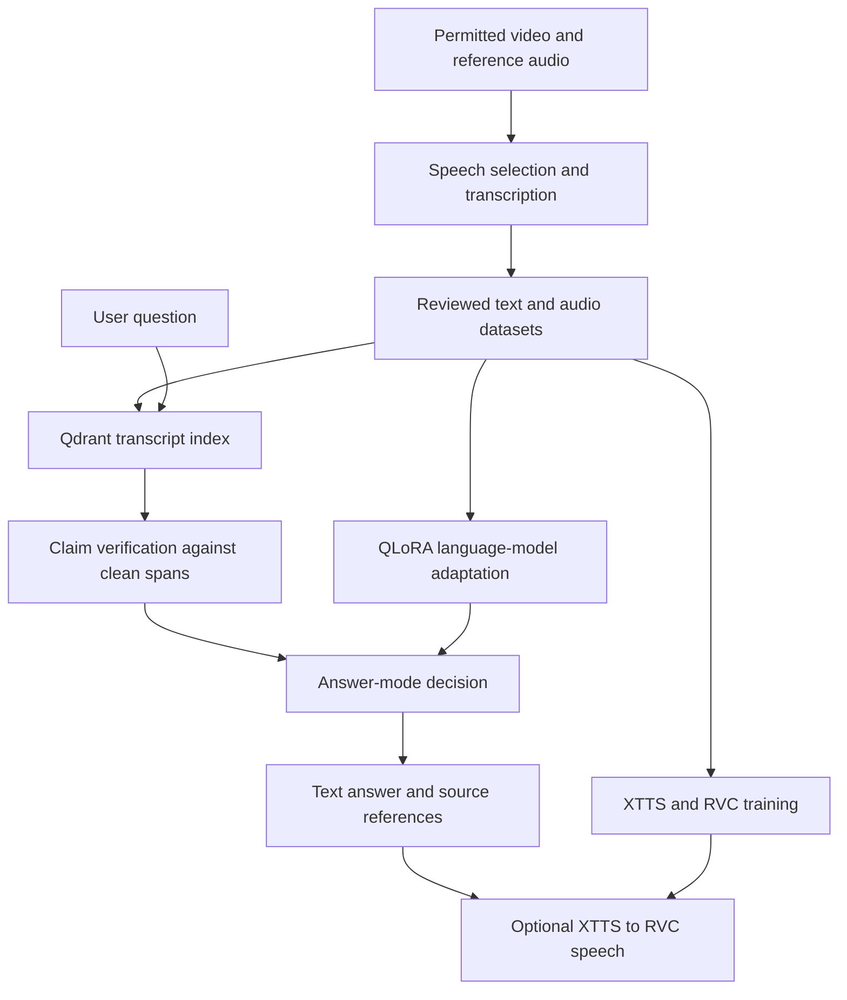

# youtuber-clone

**Speaker-style language modeling, transcript-grounded answers, and synthetic speech in a local research application.**

[English](#english) · [Türkçe](#türkçe)

## English

### Overview

This project connects video-to-dataset processing, language-model adaptation, retrieval-augmented generation (RAG), and voice conversion. It is a generic source release, with no particular person's identity or ready-made clone attached.

The repository includes Python pipelines, training notebooks, evaluation tools, isolated application workers, and a .NET/WPF Windows launcher. **Video archives, real transcript datasets, speaker recordings, trained weights, vector databases, and ready-to-use installers are not included.** Supply your own permitted data and model artifacts to run the complete system.

### Our cloning method

1. **Isolate the speaker.** Download permitted audio with yt-dlp, remove non-speech regions with Silero VAD, segment speech, and compare segments with a clean reference recording using ECAPA speaker embeddings. Transcribe selected speech with faster-whisper. Review recognition errors, repetitions, mixed-speaker content, and unsuitable clips. Calibrate thresholds on a small reviewed sample before scaling.
2. **Learn writing style.** QLoRA trains low-rank adapters on a quantized language model instead of updating every weight. Later recipes use the Qwen3 14B family and chat-formatted supervised fine-tuning to learn vocabulary, rhythm, and narrative style. Training runs in a separate GPU environment such as Google Colab; exported models run locally through Ollama. Training and inference prompt formats must stay consistent.
3. **Verify the substance.** BGE-M3 embeddings, hybrid search, reranking, and Qdrant retrieve relevant transcript passages. A separate `qwen3:4b` verifier checks question claims against exact clean transcript spans. Similarity scores rank candidates; they do not authorize an answer. Optional summary cards guide searches but are never evidence.
4. **Produce speech.** XTTS synthesizes the response text; RVC then adapts its timbre using a separately trained voice-conversion model. The isolated Voice worker verifies artifacts, validates audio, and manages memory separately from the chat process.
5. **Connect the application.** The Windows launcher coordinates Studio, retrieval, and Voice components, local communication, model discovery, file integrity, installation, and updates.



Strict grounding refuses unsupported questions. An explicitly selected fallback mode can generate an unverified answer with a warning; free mode generates without source grounding. Verification is not a guarantee that every answer is correct.

### Repository map

| Directory | Purpose |
|---|---|
| `pipeline/`, `colab/` | Audio processing, transcription, filtering, dataset assembly |
| `training/`, `inference/` | Training recipes, export, local inference experiments |
| `rag/`, `eval/` | Retrieval, evidence verification, evaluation infrastructure |
| `ui/`, `voice/`, `runtime/` | Interface, speech worker, runtime configuration |
| `app/` | .NET/WPF Windows launcher and tests |
| `distribution/`, `packaging/`, `scripts/` | Manifest validation and packaging |
| `tests/`, `docs/runbooks/` | Automated tests and operating instructions |

### Development setup

Prerequisites: Python 3.11+, `uv`, FFmpeg, and a GPU environment suitable for your models. Windows development also requires the SDK specified in `app/global.json`. Some models require account access and acceptance of their own terms.

```powershell
git clone https://github.com/mehmettahacumurcu/youtuber-clone.git
cd youtuber-clone
uv sync --frozen
uv run python -m pytest tests -m "not slow" -q
dotnet test app/YouTuberStudio.sln -c Release
```

These commands set up and test the source; they do not install a complete trained application. GPU dependencies can be large. Studio and Voice use separate pinned environments under `packaging/runtime/`; follow the [worker build guide](docs/runbooks/packaged-workers.md) for packaging.

### Configure your own data

- Set the intentionally blank `download.channel_url` or fill `download.video_urls` in `config.yaml`.
- Supply `data/reference/speaker_reference.wav`; adjust language and speaker-selection thresholds using your own reviewed recordings.
- Supply credentials through environment variables or notebook secret storage. Keep datasets and training output outside Git. Automatic Git checkpoints are disabled by default in the Colab runners; `--checkpoint` is an explicit opt-in for a separate private data repository.
- Process one video first, inspect each stage, then assemble the dataset and build its index.

```powershell
uv run python -m pipeline.download --config config.yaml --video-id YOUR_VIDEO_ID
# Continue with vad, diarize, identify, transcribe, filter, clean, and assemble.
uv run python -m rag.index
```

Environment overrides use `YOUTUBER_`, e.g. `YOUTUBER_IDENTIFY__SIMILARITY_THRESHOLD`. `speaker-*` model names and `your-account` asset repositories are placeholders. Historical research helpers may contain example paths and corpus-specific heuristics: adapt them before use. Generic prompt templates differ from the private experiments; compatibility with old weights is not assumed.

### Evaluation and release scope

This release has a fresh source-only history. Real-corpus evaluation suites, source excerpts in those suites, notebook outputs, and personal reports are excluded. Small synthetic distribution fixtures and a generated sine-wave fixture are retained. Tests needing the omitted evaluation suites are not collected until those fixtures are supplied; worker-binary tests can skip when executables have not been built. Source tests do not establish voice similarity, answer accuracy, or installation success on every GPU.

See [validation scope](docs/VALIDATION.md), [clean-machine testing](docs/runbooks/clean-machine-release-test.md), and [installer troubleshooting](docs/runbooks/installer-troubleshooting.md).

### License and use

Original code is licensed under [Apache-2.0](LICENSE), consistent with the existing [code license notice](packaging/windows/assets/LICENSE-code.txt). [Third-party notices](packaging/windows/assets/THIRD-PARTY-NOTICES.txt) and the [Applio notice](third_party/NOTICE-Applio.txt) are preserved. Code licensing does not grant rights to recordings, datasets, voices, or pretrained models. Use recordings with the speaker's permission, label generated text and audio as synthetic, and do not present them as a real person's statements or endorsement.

## Türkçe

### Proje hakkında

Bu proje; video arşivinden veri hazırlamayı, dil modeline anlatım üslubu kazandırmayı, kaynaklara dayalı yanıt üretmeyi ve ses dönüşümünü yerel bir uygulamada birleştirir. Genel amaçlı bir kaynak kod yayınıdır; belirli bir kişiyi temsil etmez ve hazır bir kişinin klonunu içermez.

Depoda Python veri işleme aşamaları, eğitim defterleri, değerlendirme araçları, ayrı uygulama süreçleri ve .NET/WPF Windows başlatıcısı bulunur. **Video arşivi, gerçek transkript veri kümesi, konuşmacı kayıtları, eğitilmiş modeller, vektör veri tabanı ve hazır kurulum dosyası dahil değildir.** Tam kullanım için izinli kendi verilerinizi ve model dosyalarınızı hazırlamanız gerekir.

### Klonlama yöntemimiz

1. **Konuşmacıya ait veriyi ayırma:** yt-dlp ile ses alınır, Silero VAD ile konuşma dışı bölümler ayıklanır. Konuşma parçaları ECAPA ses temsilleriyle temiz bir referans kayıtla karşılaştırılır. Seçilen parçalar faster-whisper ile metne çevrilir. Hatalı yazımlar, tekrarlar, başka konuşmacıların sözleri ve uygun olmayan ses parçaları incelenip temizlenir. Büyük veri kümesine geçmeden önce küçük bir örnek üzerinde eşikler ayarlanır.
2. **Anlatım üslubunu öğretme:** QLoRA ile bütün model ağırlıkları yerine küçük uyarlama katmanları eğitilir. Son tariflerde Qwen3 14B ailesi ve sohbet biçimindeki eğitim örnekleri kullanılır. Amaç kelime seçimini, anlatım ritmini ve üslubu öğrenmektir. Eğitim Google Colab gibi ayrı bir GPU ortamında yapılır; dışa aktarılan modeller yerelde Ollama ile çalışır. Eğitim ve kullanım istemlerinin biçimi tutarlı tutulur.
3. **Yanıtı kaynakla denetleme:** BGE-M3, karma arama, yeniden sıralama ve Qdrant ile ilgili transkriptler bulunur. Ayrı bir `qwen3:4b` modeli sorudaki iddiaları temiz kaynak metinleriyle karşılaştırır. Benzerlik puanı tek başına yanıt üretme izni vermez. Özet kartları aramaya yardımcı olur, kanıt yerine geçmez.
4. **Ses üretme:** XTTS yanıt metnini sese dönüştürür; RVC ayrı eğitilmiş bir ses dönüşüm modeliyle tınıyı uyarlar. Ses işlemlerini yürüten ayrı süreç model dosyalarını ve çıktıyı kontrol eder, bellek kullanımını yönetir.
5. **Uygulamada birleştirme:** Windows başlatıcısı sohbet, kaynak arama ve ses bileşenlerini yönetir; yerel iletişim, dosya doğrulama, kurulum ve güncelleme işlemlerini koordine eder.

Kullanım akışı: **soru → kaynak araması → iddia doğrulaması → yanıt modu kararı → metin ve kaynak gösterimi → isteğe bağlı ses üretimi.**

Sıkı kaynak modunda yeterli kanıt yoksa yanıt verilmez. Kullanıcının seçtiği alternatif mod doğrulanmamış yanıtı uyarıyla üretebilir. Serbest mod kaynak denetimi yapmaz. Kaynak kontrolü her yanıtın doğruluğuna dair kesin güvence değildir.

### Kurulum ve yapılandırma

Yukarıdaki geliştirme komutlarıyla kaynakları ve test ortamını kurabilirsiniz. Python 3.11+, `uv`, FFmpeg ve modellere uygun GPU ortamı gerekir. Windows geliştirmesi için `app/global.json` içindeki .NET SDK sürümünü kullanın. Bu komutlar modelleri hazırlayıp tam uygulamayı kendiliğinden çalıştırmaz.

`config.yaml` içindeki boş kanal adresini veya video listesini doldurun. Referans sesi `data/reference/speaker_reference.wav` konumuna yerleştirin. Dil ve konuşmacı benzerliği eşiklerini kendi verinizle ayarlayın. Parolaları ve erişim anahtarlarını kaynak dosyalarına yazmayın; ortam değişkenleri veya defterin gizli bilgi alanlarını kullanın. Verileri ve eğitim çıktılarını Git dışında saklayın.

`YOUTUBER_` öneki ortam değişkenleriyle ayar değiştirmek içindir. `speaker-*` model adları ve `your-account` model depoları kendi dosyalarınızla değiştireceğiniz örneklerdir. Eski araştırma yardımcılarında örnek dosya yolları ve veri kümesine bağlı kurallar bulunabilir. Genel istemler özel deneylerden farklı olduğundan eski model ağırlıklarıyla uyumluluk varsayılmamalıdır.

### Test kapsamı ve lisans

Gerçek veriye bağlı değerlendirme dosyaları ve içerdikleri alıntılar, defter çıktıları ve kişisel raporlar yayına alınmamıştır. Bu değerlendirme dosyalarına bağlı testler, veriler ayrıca sağlanana kadar toplanmaz. Derlenmiş çalışan süreç dosyaları yoksa ilgili testler atlanabilir. Küçük yapay test verileri ve üretilmiş sinüs sesi korunmuştur. Yazılım testleri ses benzerliği, tüm yanıtların doğruluğu veya her bilgisayarda sorunsuz kurulum anlamına gelmez. Ayrıntılar: [doğrulama kapsamı](docs/VALIDATION.md).

Özgün kod [Apache-2.0](LICENSE) kapsamındadır. Üçüncü taraf lisansları korunur; kod lisansı seslere, verilere veya modellere kullanım hakkı vermez. Konuşmacının izin verdiği kayıtları kullanın, üretilen metin ve sesin yapay olduğunu belirtin ve bunları gerçek kişinin sözü ya da onayı gibi sunmayın.
